# MediAI - AI Powered Healthcare Management System

<div align="center">

# 🏥 MediAI

### AI-Powered Healthcare Management Platform

Modern Full Stack Healthcare Management System built using Spring Boot and React.

🔗 Live Frontend:  
https://medi-ai-dun.vercel.app/

🔗 Live Backend API:  
https://mediai-backend-ckjn.onrender.com

🔗 GitHub Repository:  
https://github.com/yadavraushan721/MediAI

</div>

---

# 📌 Project Overview

MediAI is a production-ready Healthcare Management System designed for:

- 👨‍💼 Admin
- 👨‍⚕️ Doctors
- 🧑‍🤝‍🧑 Patients

The system provides secure authentication, doctor approval workflow, appointment booking, medical records management, dashboard analytics, and role-based access control.

---

# ✨ Core Features

## 🔐 Authentication & Security

✅ JWT Authentication  
✅ Spring Security  
✅ Role-Based Access Control  
✅ Protected Routes  
✅ Secure REST APIs

---

## 👨‍💼 Admin Features

✅ Dashboard Analytics  
✅ Doctor Management  
✅ Pending Doctor Approval  
✅ Patients Management  
✅ Appointment Monitoring  
✅ Search & Pagination

---

## 👨‍⚕️ Doctor Features

✅ Doctor Dashboard  
✅ View Patient Appointments  
✅ Complete / Cancel Appointments  
✅ Create Medical Records  
✅ Manage Prescriptions

---

## 🧑‍🤝‍🧑 Patient Features

✅ Register & Login  
✅ Book Appointments  
✅ View Appointment Status  
✅ Access Medical History  
✅ Dashboard Analytics

---

# 🛠️ Tech Stack

## Backend

- Java 21
- Spring Boot
- Spring Security
- JWT Authentication
- Hibernate / JPA
- PostgreSQL
- Maven

---

## Frontend

- React
- Tailwind CSS
- Axios
- React Router DOM
- React Toastify
- Recharts

---

# 🚀 Production Features

✅ Doctor approval system  
✅ Doctor-specific appointments  
✅ Patient-specific appointments  
✅ Admin management  
✅ Profile management  
✅ Live deployment  
✅ Render backend hosting  
✅ Vercel frontend hosting  
✅ Live PostgreSQL database  
✅ Dynamic dashboards  
✅ Responsive UI  
✅ Modern modal interfaces

---

# 🖼️ Application Screenshots

---

# 🏠 Landing Page

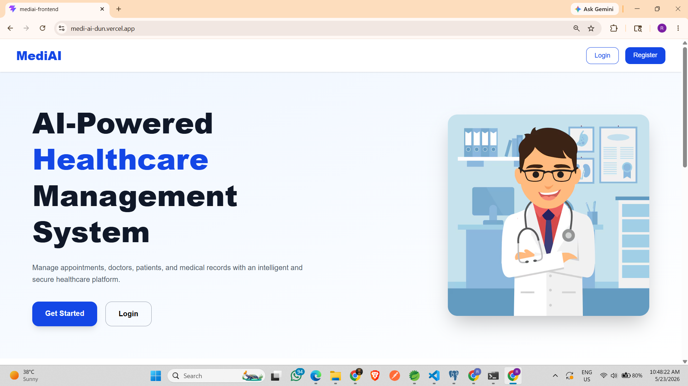

---

# 🔐 Register Page

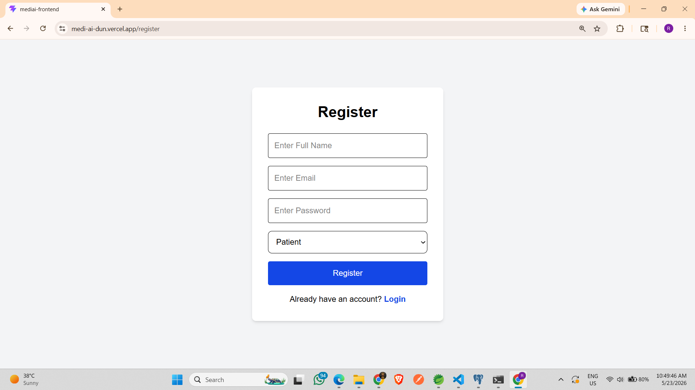

---

# 🔐 Login Page

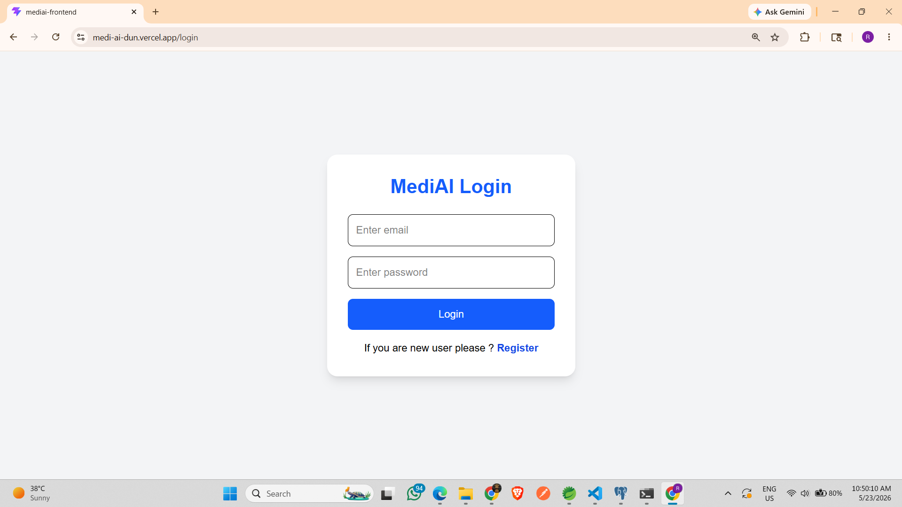

---

# 👨‍💼 Admin Dashboard

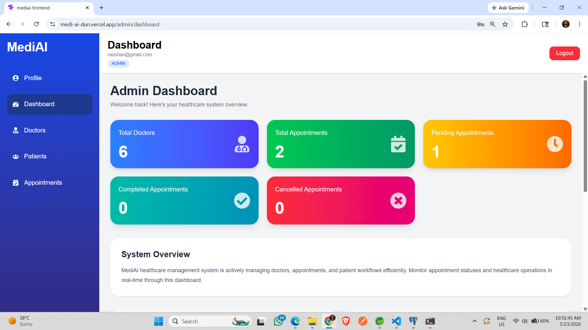

---

# 📊 Dashboard Analytics

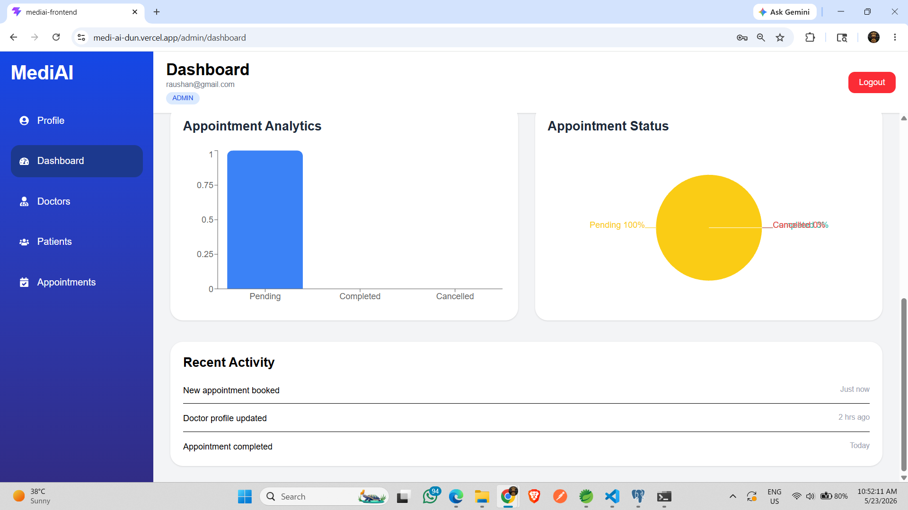

---

# 👨‍⚕️ Doctors Management

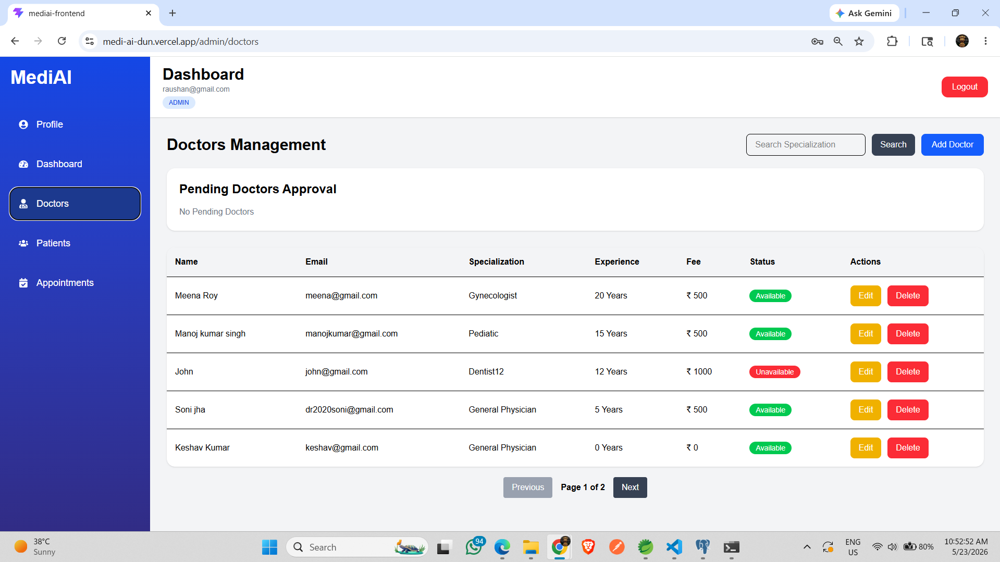

---

# 🧑‍🤝‍🧑 Patients Management


---

# 📅 Appointments Management

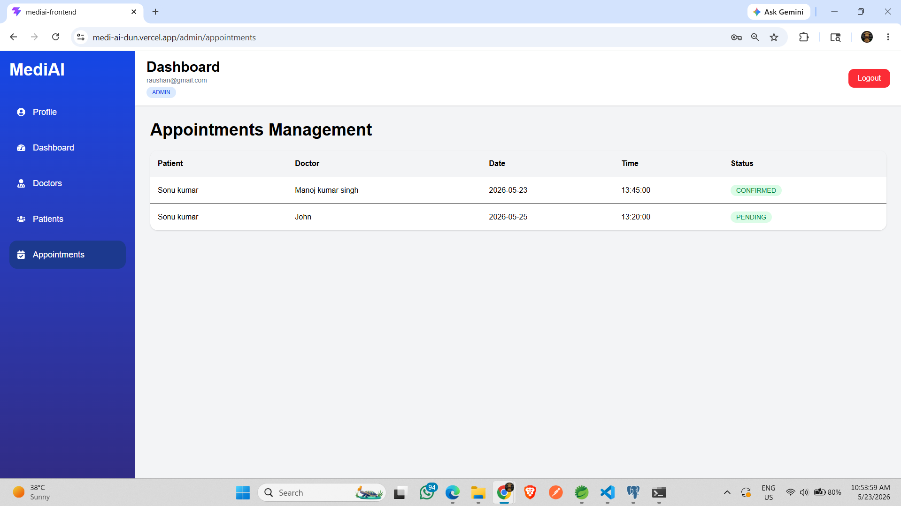

---

# 👨‍⚕️ Doctor Dashboard


---

# 📋 Doctor Appointments

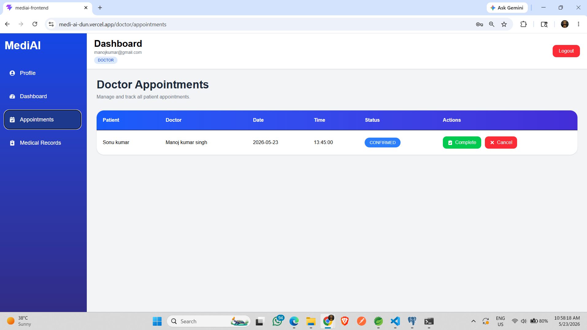

---

# 🩺 Medical Records

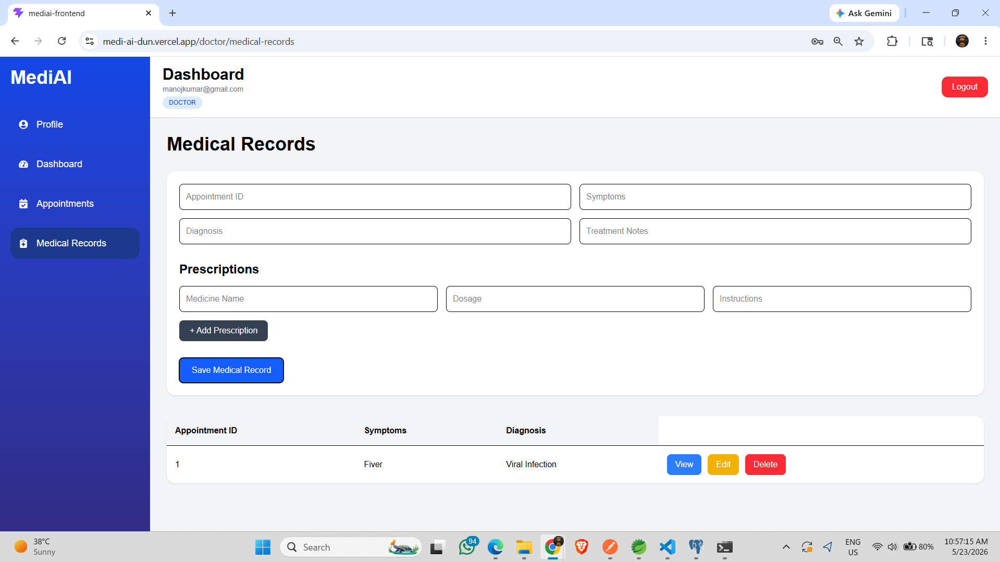

---

# 🧑‍🤝‍🧑 Patient Dashboard

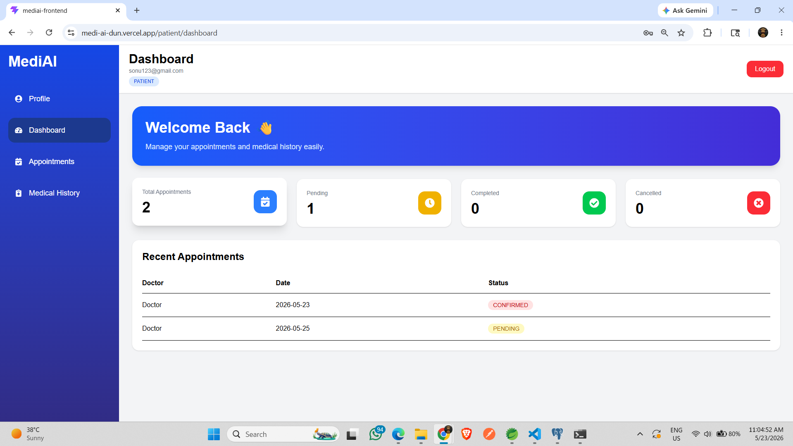

---

# 📅 Patient Appointments

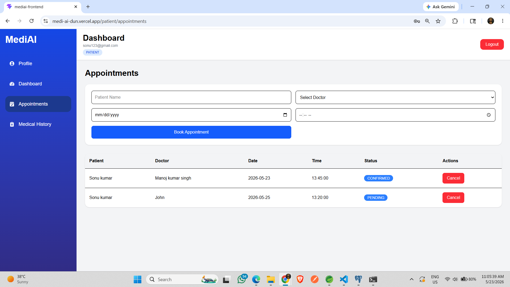

---

# 📖 Medical History

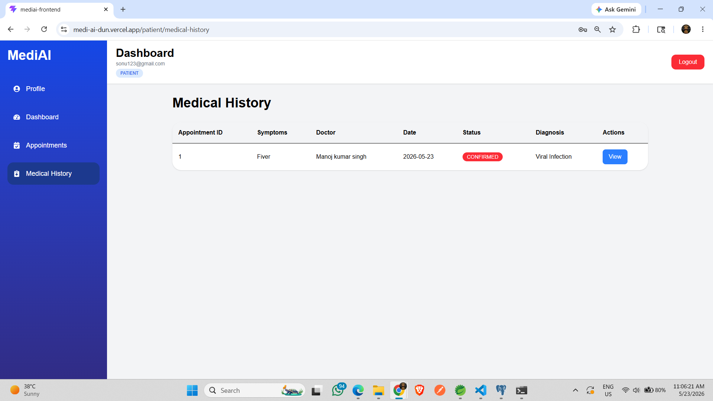

---

# 🏗️ System Architecture

```text
React Frontend
      ↓
REST API Communication
      ↓
Spring Boot Backend
      ↓
Spring Security + JWT
      ↓
PostgreSQL Database
```

---

# 📂 Project Structure

```bash
MediAI/
│
├── README.md
├── .gitignore
│
├── assets/
│   ├── home.png
│   ├── register.png
│   ├── login.png
│   ├── admin-dashboard.png
│   ├── admin-analytics.png
│   ├── admin-doctors.png
│   ├── admin-patients.png
│   ├── admin-appointments.png
│   ├── doctor-dashboard.png
│   ├── doctor-appointments.png
│   ├── medical-records.png
│   ├── patient-dashboard.png
│   ├── patient-appointments.png
│   └── medical-history.png
│
├── mediai-backend/
│
└── mediai-frontend/
```

---

# ⚙️ Environment Variables

## Frontend (.env)

```env
VITE_API_BASE_URL=https://mediai-backend-ckjn.onrender.com
```

---

# 🚀 Installation Guide

## 1️⃣ Clone Repository

```bash
git clone https://github.com/yadavraushan721/MediAI.git
```

---

## 2️⃣ Backend Setup

```bash
cd mediai-backend
```

### Configure PostgreSQL

Update `application.properties`

```properties
spring.datasource.url=YOUR_DB_URL
spring.datasource.username=YOUR_DB_USERNAME
spring.datasource.password=YOUR_DB_PASSWORD
```

---

### Run Backend

```bash
mvn spring-boot:run
```

---

## 3️⃣ Frontend Setup

```bash
cd mediai-frontend
npm install
npm run dev
```

---

# 🔑 API Highlights

## Authentication APIs

- Register User
- Login User
- JWT Token Generation

---

## Admin APIs

- Manage Doctors
- Approve Doctors
- Manage Patients
- View Appointments

---

## Doctor APIs

- Complete Appointment
- Cancel Appointment
- Create Medical Record

---

## Patient APIs

- Book Appointment
- Cancel Appointment
- View Medical History

---

# 📊 Key Highlights

✅ Full Stack Production Project  
✅ Secure Authentication System  
✅ REST API Architecture  
✅ Real-Time Dashboard Data  
✅ Responsive UI Design  
✅ Role-Based Authorization  
✅ PostgreSQL Integration  
✅ Deployment Ready Architecture

---

# 🔮 Future Enhancements

- AI Symptom Checker
- Video Consultation
- Email Notifications
- Payment Gateway
- Prescription PDF Download
- Doctor Availability Calendar
- Chat System
- AI Health Recommendation

---

# 👨‍💻 Developed By

## Raushan Kumar Yadav

Java Full Stack Developer

GitHub:  
https://github.com/yadavraushan721

---

# ⭐ Support

If you like this project:

⭐ Star the repository  
🍴 Fork the project  
📢 Share with others

---

# 📄 License

This project is developed for educational and portfolio purposes.
